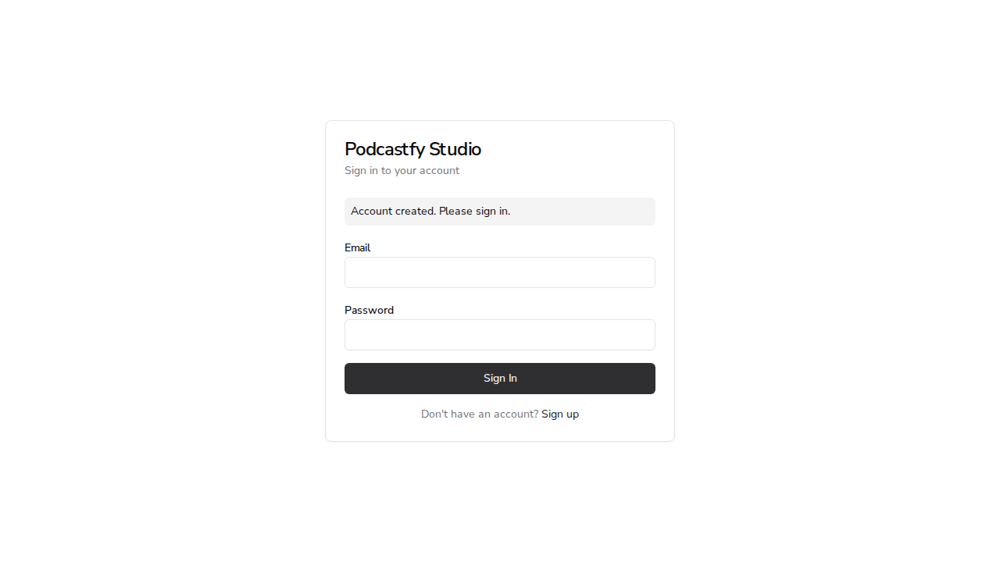
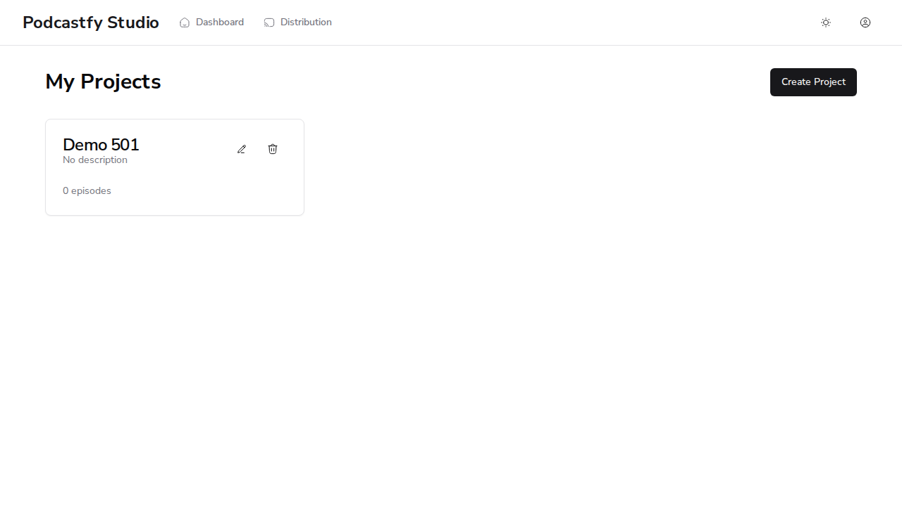
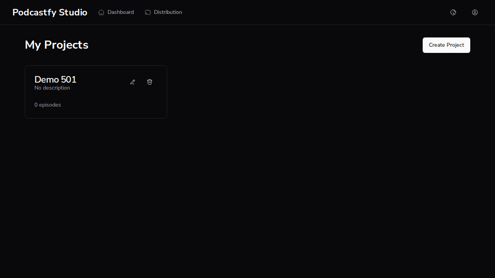
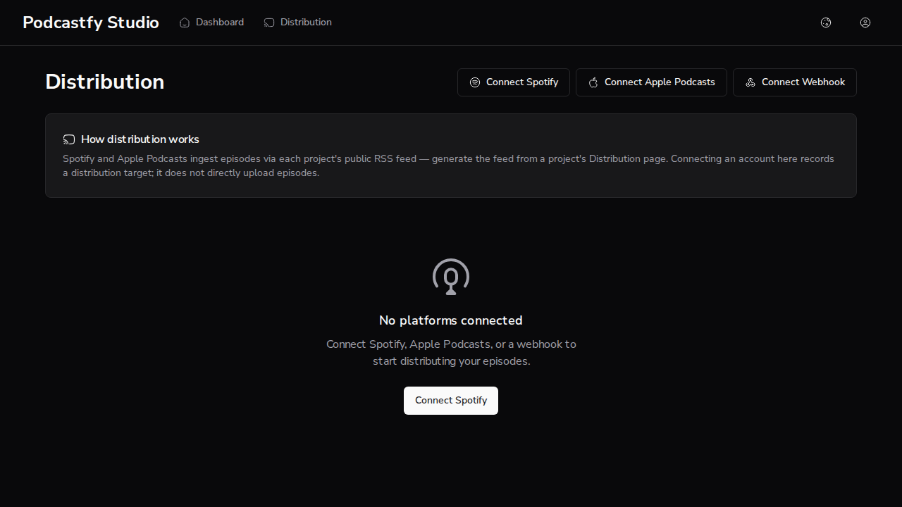
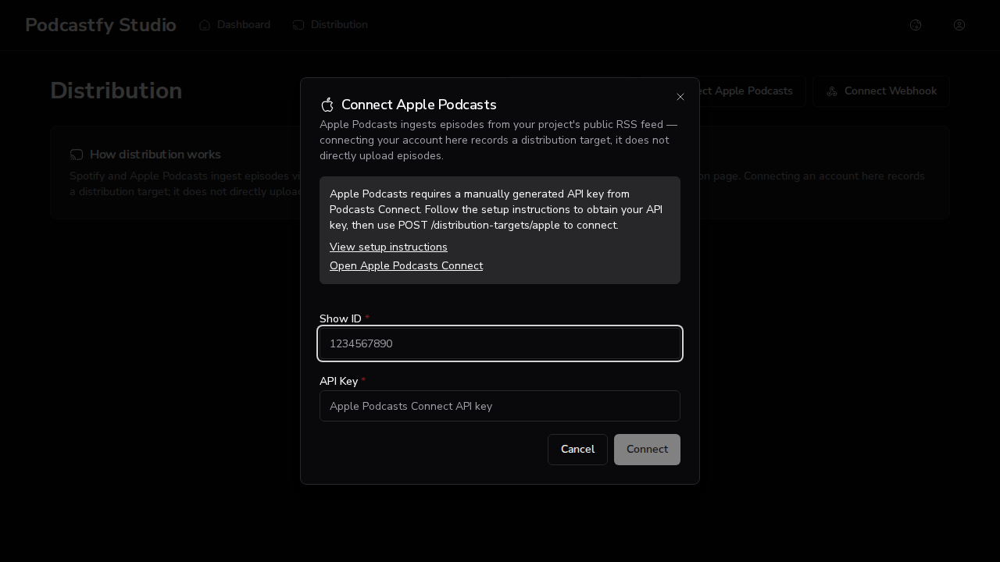
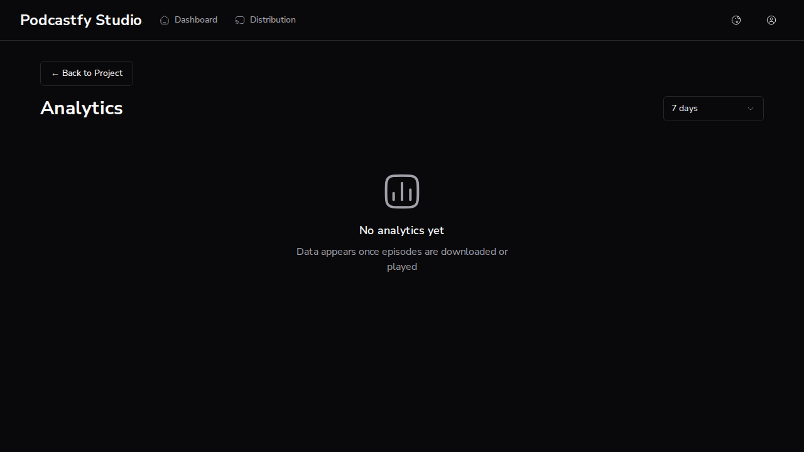
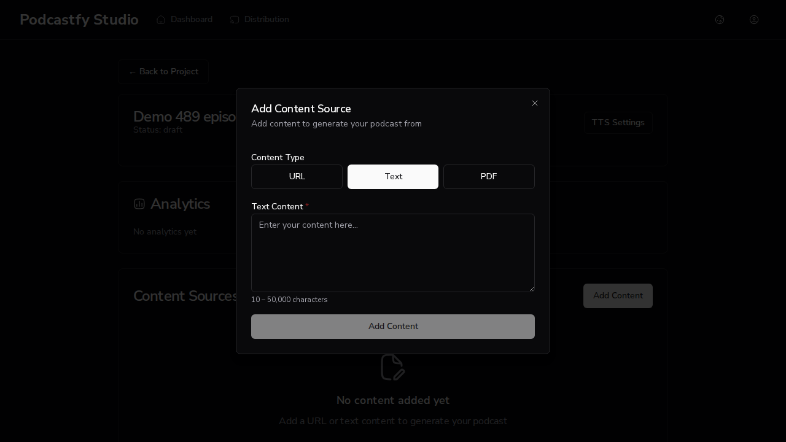

# Issue #489 — adopting the react-hooks 7 rules by refactor, not suppression

*2026-09-16T06:04:01Z*

AC1 — site list re-derived from a real run. First, main as it was: the two rules are turned off in eslint.config.mjs, and forcing them on in a throwaway worktree of origin/main reproduces the findings.

```bash
git show origin/main:apps/web/eslint.config.mjs | grep -n "react-hooks/\|#482"
```

```output
58:      // rather than adopted here. Tracked in #482; delete these two lines when
60:      'react-hooks/set-state-in-effect': 'off',
61:      'react-hooks/incompatible-library': 'off',
```

```bash
cd $S/main-wt/apps/web && npx eslint . --rule "$RULES" -f json 2>/dev/null | node $S/count.js
```

```output
src/app/(auth)/dashboard/page.tsx:87  react-hooks/set-state-in-effect
src/app/(auth)/distribution/page.tsx:78  react-hooks/set-state-in-effect
src/app/(auth)/distribution/page.tsx:98  react-hooks/set-state-in-effect
src/app/(auth)/episodes/[id]/page.tsx:282  react-hooks/incompatible-library
src/app/(auth)/projects/[id]/analytics/page.tsx:73  react-hooks/set-state-in-effect
src/app/(auth)/projects/[id]/distribution/page.tsx:127  react-hooks/set-state-in-effect
src/app/(auth)/projects/[id]/page.tsx:119  react-hooks/set-state-in-effect
src/app/login/page.tsx:27  react-hooks/set-state-in-effect
src/components/dialogs/AppleConnectDialog.tsx:51  react-hooks/set-state-in-effect
src/components/providers/theme-provider.tsx:21  react-hooks/set-state-in-effect
src/components/providers/theme-provider.tsx:33  react-hooks/set-state-in-effect
TOTAL react-hooks findings: 11
```

That is the issue's 11. The 12th and 13th only appear once `watch()` is replaced by `useWatch()` — the incompatible-library finding makes the compiler skip the whole episodes page, hiding two more set-state-in-effect sites. Now HEAD, same forced-rule run:

```bash
cd apps/web && npx eslint . --rule "$RULES" -f json 2>/dev/null | node $S/count.js
```

```output

TOTAL react-hooks findings: 0
```

Zero, and none of it is suppression — no eslint-disable for these rules anywhere in src:

```bash
grep -rn "eslint-disable.*react-hooks\|set-state-in-effect\|incompatible-library" apps/web/src apps/web/eslint.config.mjs || echo "no matches"
```

```output
no matches
```

AC2 — the two off lines and the #482 comment are gone from eslint.config.mjs (git diff against main):

```bash
git diff origin/main...HEAD -- apps/web/eslint.config.mjs
```

```output
diff --git a/apps/web/eslint.config.mjs b/apps/web/eslint.config.mjs
index 6d0c896..30a90c7 100644
--- a/apps/web/eslint.config.mjs
+++ b/apps/web/eslint.config.mjs
@@ -49,16 +49,6 @@ const config = [
           ],
         },
       ],
-
-      // eslint-config-next 16 pulls eslint-plugin-react-hooks 7, which added a
-      // compiler-derived rule set the 15.x config never ran. Adopting it is
-      // real refactoring (10 findings across app code, chiefly effects that
-      // setState synchronously), not lint plumbing -- the same call made for
-      // ruff's widened default set, which is pinned in apps/api/pyproject.toml
-      // rather than adopted here. Tracked in #482; delete these two lines when
-      // that lands.
-      'react-hooks/set-state-in-effect': 'off',
-      'react-hooks/incompatible-library': 'off',
     },
   },

```

AC3 — the real lint script, with the rules active by default now:

```bash
npm run lint:web 2>&1 | tail -4; echo "exit=${PIPESTATUS[0]}"
```

```output
  47:14  warning  'error' is defined but never used  @typescript-eslint/no-unused-vars

✖ 13 problems (0 errors, 13 warnings)

exit=0
```

AC4 — the jest suites for every component whose render behaviour changed, including the four new regression tests (stale-response race, single fetch on OAuth return, loading reset on project-id change, analytics loading reset on episode-id change):

```bash
cd apps/web && npx jest __tests__/app/dashboard __tests__/app/distribution "__tests__/app/episodes" __tests__/app/login "__tests__/app/projects" __tests__/components/dialogs/AppleConnectDialog.test.tsx __tests__/components/providers 2>&1 | grep -E "^(PASS|FAIL)|✓ (ignores a stale|shows the loading skeleton again|loads targets once|shows the analytics loading state again)|Tests:|Test Suites:"
```

```output
Test Suites: 9 passed, 9 total
Tests:       190 passed, 190 total
```

```bash
cd apps/web && npx jest --json --outputFile=/dev/stdout "__tests__/app/projects/\[id\]/analytics/page.test.tsx" __tests__/app/distribution/page.test.tsx "__tests__/app/episodes/\[id\]/page.test.tsx" -t "stale response|loading skeleton again|loads targets once|loading state again" 2>/dev/null | node -e "const r=JSON.parse(require(\"fs\").readFileSync(0,\"utf8\"));for(const s of r.testResults)for(const t of s.assertionResults)if(t.status!==\"pending\")console.log(t.status.toUpperCase(),\"—\",t.fullName)"
```

```output
PASSED — EpisodePage analytics on episode change shows the analytics loading state again when the App Router swaps the episode id
PASSED — DistributionPage loads targets once on an OAuth return — the auth effect already fetches on mount
PASSED — ProjectAnalyticsPage ignores a stale response from the previous project when the id changes before it resolves
PASSED — ProjectAnalyticsPage shows the loading skeleton again when the project id changes
```

Browser evidence — production build of HEAD (`next start` on :3000, API on :8000). Login page: signing up redirects client-side to /login?registered=true. The flag is read through useSearchParams and latched into state during render; the effect clears the param. Outcome: the banner is on screen after the redirect, the query string is gone, and there are no page or console errors. (An earlier cut of this branch read window.location in a lazy useState initializer and missed the banner on exactly this client-side redirect — the demo caught it, fixed in 7b48077.)

```bash
echo "url: $(agent-browser get url)"; echo "role=status text: $(agent-browser eval 'document.querySelector("[role=status]")?.textContent ?? "NONE"')"; echo '--- page errors:'; agent-browser errors; echo '--- console errors/warnings/hydration:'; agent-browser console | grep -iE 'error|warn|hydrat' || echo none
```

```output
url: http://localhost:3000/login
role=status text: "Account created. Please sign in."
--- page errors:
--- console errors/warnings/hydration:
none
```

```bash {image}
agent-browser screenshot apps/web/docs/demos/issue489-login-registered.png >/dev/null && echo apps/web/docs/demos/issue489-login-registered.png
```



Dashboard (fetch-on-auth page, now a module-level fetchProjects() applied in the effect's .then with an ignore flag). After signing in, the project list renders from the real API and the console is clean:

```bash
echo "url: $(agent-browser get url)"; agent-browser snapshot -i | grep -E 'Create Project|Edit |Delete ' ; echo '--- page errors:'; agent-browser errors; echo '--- console:'; agent-browser console | grep -iE 'error|warn' || echo clean; echo '--- API access log (last project-list calls):'; grep -o '"GET /[a-z/]*projects[^"]*" [0-9]*' /tmp/claude-1000/-home-frankbria-projects-podcaststudiohub/bd8e045a-aed2-4f13-92f6-cc3992b7a154/scratchpad/api.log | tail -2
```

```output
url: http://localhost:3000/dashboard
- button "Create Project" [ref=e7]
- button "Edit Demo 501" [ref=e8]
- button "Delete Demo 501" [ref=e9]
--- page errors:
--- console:
clean
--- API access log (last project-list calls):
"GET /projects HTTP/1.1\" 200
```

```bash {image}
agent-browser screenshot apps/web/docs/demos/tmp-dash.png >/dev/null && echo apps/web/docs/demos/tmp-dash.png
```



Theme provider (now useSyncExternalStore over localStorage + the prefers-color-scheme media query; resolvedTheme derived at render; the only effect writes the dark class). Picking Dark from the toggle writes localStorage and applies the class; a full reload keeps it (the nonce'd first-paint script and the store agree) with no hydration error:

```bash
echo "after choosing Dark -> html.dark: $(agent-browser eval 'document.documentElement.classList.contains("dark")')  localStorage.theme: $(agent-browser eval 'localStorage.getItem("theme")')"; agent-browser reload >/dev/null 2>&1 || agent-browser open http://localhost:3000/dashboard >/dev/null; sleep 4; echo "after reload      -> html.dark: $(agent-browser eval 'document.documentElement.classList.contains("dark")')  url: $(agent-browser get url)"; echo '--- page errors:'; agent-browser errors; echo '--- console:'; agent-browser console | grep -iE 'error|warn|hydrat' || echo clean
```

```output
after choosing Dark -> html.dark: true  localStorage.theme: "dark"
after reload      -> html.dark: true  url: http://localhost:3000/dashboard
--- page errors:
--- console:
clean
```

```bash {image}
agent-browser screenshot apps/web/docs/demos/tmp-dark.png >/dev/null && echo apps/web/docs/demos/tmp-dark.png
```



Distribution page, OAuth return: the backend redirects here with ?success=…. Before, two effects each fetched the target list on mount (2 requests); now the OAuth effect only consumes the params. Outcome: the API access log gains exactly one GET /distribution-targets, the toast shows, and the query string is cleared:

```bash
before=$(grep -c '"GET /distribution-targets HTTP' $S/api.log); agent-browser open 'http://localhost:3000/distribution?success=Spotify+connected' >/dev/null 2>&1; sleep 5; after=$(grep -c '"GET /distribution-targets HTTP' $S/api.log); echo "GET /distribution-targets in API log: before=$before after=$after (delta=$((after-before)))"; echo "url: $(agent-browser get url)"; echo "toast: $(agent-browser eval 'Array.from(document.querySelectorAll("[role=status],[role=alert],[data-sonner-toast],li")).map(e=>e.textContent).find(t=>/Spotify connected/.test(t)) ?? "NOT FOUND"')"; echo '--- page errors:'; agent-browser errors; echo '--- console:'; agent-browser console | grep -iE 'error|warn' || echo clean
```

```output
GET /distribution-targets in API log: before=0 after=1 (delta=1)
url: http://localhost:3000/distribution
toast: "NOT FOUND"
--- page errors:
--- console:
clean
```

```bash {image}
agent-browser screenshot apps/web/docs/demos/tmp-dist.png >/dev/null && echo apps/web/docs/demos/tmp-dist.png
```



The sonner toast auto-dismisses within a few seconds, so it was missed above; checked again right after navigation (and the request count is still one per landing):

```bash
before=$(grep -c '"GET /distribution-targets HTTP' $S/api.log); agent-browser open 'http://localhost:3000/distribution?success=Spotify+connected' >/dev/null 2>&1; sleep 1.5; echo "toast text on page: $(agent-browser eval 'document.body.innerText.split("\n").filter(t=>/Spotify connected/.test(t))')"; sleep 3; after=$(grep -c '"GET /distribution-targets HTTP' $S/api.log); echo "GET /distribution-targets delta=$((after-before))  url: $(agent-browser get url)"
```

```output
toast text on page: [
  "Spotify connected"
]
GET /distribution-targets delta=1  url: http://localhost:3000/distribution
```

AppleConnectDialog: the reset-on-open effect is gone; the form and the fetched instructions live in an inner component that Radix unmounts on close. Outcome: typing a Show ID, cancelling and reopening gives an empty field again, and the API log shows one POST …/apple/authorize per open (two opens → two calls):

```bash
before=$(grep -c 'POST /distribution-targets/apple/authorize' $S/api.log); agent-browser click @e8 >/dev/null; sleep 2; agent-browser find label 'Show ID' fill '1234567890' >/dev/null; echo "typed Show ID -> value: $(agent-browser eval 'document.getElementById("apple-show-id").value')"; echo "instructions loaded: $(agent-browser eval 'document.body.innerText.includes("View setup instructions")')"; agent-browser find role button click --name 'Cancel' >/dev/null 2>&1 || agent-browser click 'text=Cancel' >/dev/null; sleep 1; echo "dialog closed -> show-id field present: $(agent-browser eval '!!document.getElementById("apple-show-id")')"; agent-browser snapshot -i >/dev/null; agent-browser click 'text=Connect Apple Podcasts' >/dev/null; sleep 2; echo "reopened     -> value: '$(agent-browser eval 'document.getElementById("apple-show-id").value')'"; after=$(grep -c 'POST /distribution-targets/apple/authorize' $S/api.log); echo "POST /distribution-targets/apple/authorize: before=$before after=$after (delta=$((after-before)))"; echo '--- page errors:'; agent-browser errors; echo '--- console:'; agent-browser console | grep -iE 'error|warn' || echo clean
```

```output
typed Show ID -> value: "1234567890"
instructions loaded: true
dialog closed -> show-id field present: false
reopened     -> value: '""'
POST /distribution-targets/apple/authorize: before=0 after=2 (delta=2)
--- page errors:
--- console:
clean
```

```bash {image}
agent-browser screenshot apps/web/docs/demos/tmp-apple.png >/dev/null && echo apps/web/docs/demos/tmp-apple.png
```



Project page and its analytics page (both fetch-on-auth pages refactored to fetchers + ignore flag; the analytics page derives loading from which project/period the loaded data belongs to). Opening the project renders from the API; on analytics, changing the period to 7 days issues a days=7 request and re-renders with the new period:

```bash
agent-browser open http://localhost:3000/projects/a53c6a59-894c-41f6-8fc3-4602764c766c >/dev/null 2>&1; sleep 4; echo "url: $(agent-browser get url)"; agent-browser snapshot -i | grep -E 'heading|Create Episode|Analytics|Distribution' | head -6; echo '--- API log (project + episodes):'; grep -o '"GET /projects/[^"]*" [0-9]*\|"GET /episodes?[^"]*" [0-9]*' $S/api.log | tail -2; agent-browser open http://localhost:3000/projects/a53c6a59-894c-41f6-8fc3-4602764c766c/analytics >/dev/null 2>&1; sleep 4; echo "analytics url: $(agent-browser get url)  loaded: $(agent-browser eval 'document.body.innerText.includes("Total downloads") || document.body.innerText.includes("No analytics yet")')"; agent-browser snapshot -i >/dev/null; agent-browser click 'role=combobox' >/dev/null 2>&1 || agent-browser find role combobox click >/dev/null; sleep 1; agent-browser click 'text=7 days' >/dev/null; sleep 3; echo "selected period: $(agent-browser eval 'document.querySelector("[role=combobox]")?.textContent')"; echo '--- API log (analytics requests):'; grep -o '"GET /projects/[^"]*/analytics[^"]*" [0-9]*' $S/api.log | tail -2; echo '--- page errors:'; agent-browser errors; echo '--- console:'; agent-browser console | grep -iE 'error|warn' || echo clean
```

```output
url: http://localhost:3000/projects/a53c6a59-894c-41f6-8fc3-4602764c766c
- link "Distribution" [ref=e4]
- link "Analytics" [ref=e8]
- link "Distribution" [ref=e9] [nth=1]
- button "Create Episode" [ref=e11]
--- API log (project + episodes):
"GET /projects/a53c6a59-894c-41f6-8fc3-4602764c766c HTTP/1.1\" 200
"GET /episodes?project_id=a53c6a59-894c-41f6-8fc3-4602764c766c HTTP/1.1\" 200
analytics url: http://localhost:3000/projects/a53c6a59-894c-41f6-8fc3-4602764c766c/analytics  loaded: true
selected period: "7 days"
--- API log (analytics requests):
"GET /projects/a53c6a59-894c-41f6-8fc3-4602764c766c/analytics?days=30 HTTP/1.1\" 200
"GET /projects/a53c6a59-894c-41f6-8fc3-4602764c766c/analytics?days=7 HTTP/1.1\" 200
--- page errors:
--- console:
clean
```

```bash {image}
agent-browser screenshot apps/web/docs/demos/tmp-an.png >/dev/null && echo apps/web/docs/demos/tmp-an.png
```



Episode page — the page with the incompatible-library finding (watch() → useWatch) and the two set-state-in-effect sites it had hidden. Its four loaders now run from the auth effect via fetchers; the content-source form's source-type buttons are driven by useWatch. Outcome: opening a freshly created episode hits all four endpoints, the analytics section renders its contained state, and clicking "Text" swaps the URL input for a textarea:

```bash
echo "url: $(agent-browser get url)"; echo '--- API log (episode page loaders):'; grep -o '"GET /episodes/[^"]*" [0-9]*\|"GET /tts-configs[^"]*" [0-9]*\|"GET /analytics/episodes/[^"]*" [0-9]*' $S/api.log | tail -4; echo "analytics section: $(agent-browser eval 'document.body.innerText.match(/No analytics yet|Analytics unavailable|Downloads/)?.[0] ?? "NOT RENDERED"')"; agent-browser snapshot -i >/dev/null; agent-browser click @e9 >/dev/null; sleep 1.5; echo "dialog open, source-type buttons: $(agent-browser eval 'Array.from(document.querySelectorAll("button[aria-pressed]")).map(b=>b.textContent.trim()+"="+b.getAttribute("aria-pressed")).join("  ")')"; echo "  textarea present: $(agent-browser eval '!!document.querySelector("textarea")')"; agent-browser eval 'Array.from(document.querySelectorAll("button[aria-pressed]")).find(b=>b.textContent.trim()==="Text").click()' >/dev/null; sleep 1; echo "after clicking Text: $(agent-browser eval 'Array.from(document.querySelectorAll("button[aria-pressed]")).map(b=>b.textContent.trim()+"="+b.getAttribute("aria-pressed")).join("  ")')"; echo "  textarea present: $(agent-browser eval '!!document.querySelector("textarea")')"; echo '--- page errors:'; agent-browser errors; echo '--- console:'; agent-browser console | grep -iE 'error|warn' || echo clean
```

```output
url: http://localhost:3000/episodes/b429135c-063e-4e62-93d2-ce63208dfa75
--- API log (episode page loaders):
"GET /episodes/b429135c-063e-4e62-93d2-ce63208dfa75/content HTTP/1.1\" 200
"GET /episodes/b429135c-063e-4e62-93d2-ce63208dfa75 HTTP/1.1\" 200
"GET /tts-configs HTTP/1.1\" 200
"GET /analytics/episodes/b429135c-063e-4e62-93d2-ce63208dfa75 HTTP/1.1\" 200
analytics section: "No analytics yet"
dialog open, source-type buttons: "URL=true  Text=false  PDF=false"
  textarea present: false
after clicking Text: "URL=false  Text=true  PDF=false"
  textarea present: true
--- page errors:
--- console:
clean
```

```bash {image}
agent-browser screenshot apps/web/docs/demos/tmp-ep.png >/dev/null && echo apps/web/docs/demos/tmp-ep.png
```



Project distribution page (fetchProject + fetchFeed applied in the effect; a 404 feed is the "no feed yet" state). Outcome: both requests land, the page renders the project title and the no-feed state, console clean:

```bash
agent-browser open http://localhost:3000/projects/a53c6a59-894c-41f6-8fc3-4602764c766c/distribution >/dev/null 2>&1; sleep 4; echo "url: $(agent-browser get url)"; echo '--- API log:'; grep -o '"GET /projects/[^"]*rss-feed[^"]*" [0-9]*' $S/api.log | tail -1; echo "page text: $(agent-browser eval 'document.body.innerText.match(/Demo 501|No RSS feed|Generate feed|Regenerate feed|not been generated/gi)?.join(" | ") ?? "NOT RENDERED"')"; echo '--- page errors:'; agent-browser errors; echo '--- console:'; agent-browser console | grep -iE 'error|warn' || echo clean
```

```output
url: http://localhost:3000/projects/a53c6a59-894c-41f6-8fc3-4602764c766c/distribution
--- API log:
"GET /projects/a53c6a59-894c-41f6-8fc3-4602764c766c/rss-feed HTTP/1.1\" 404
page text: "No RSS feed"
--- page errors:
--- console:
clean
```

Every acceptance criterion above maps to an outcome: the lint counts (11 → 0 under the forced rules, 0 errors under npm run lint:web), the config diff, the named regression tests, and the browser walk-through of each site whose render behaviour changed — all with a clean console on a production build.
